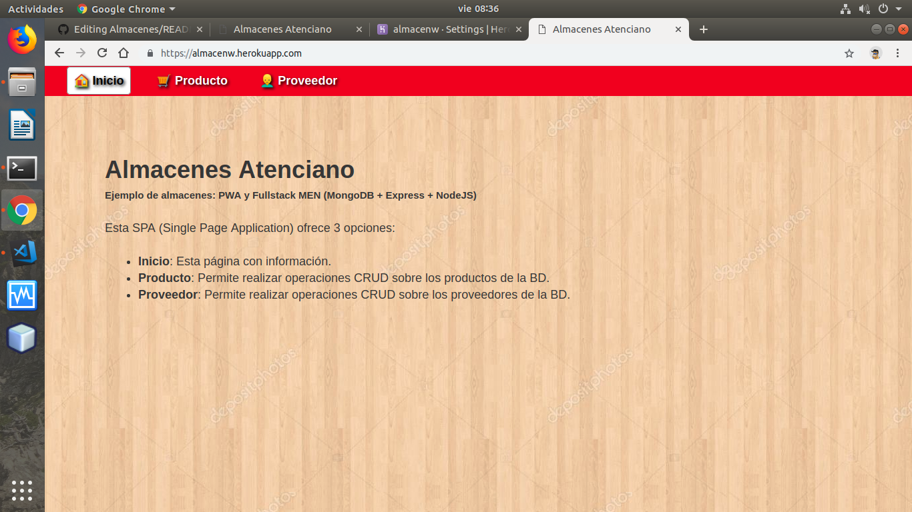
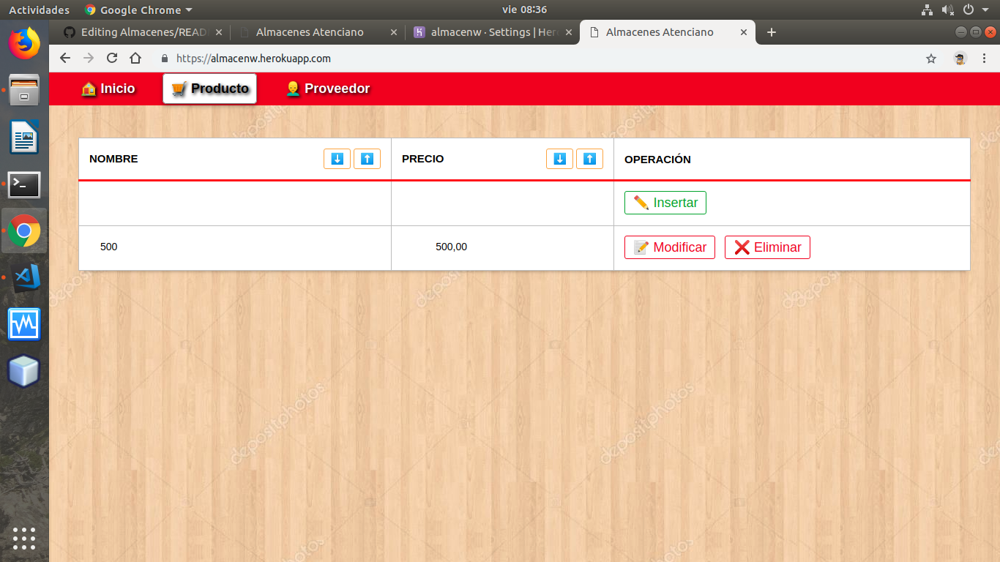
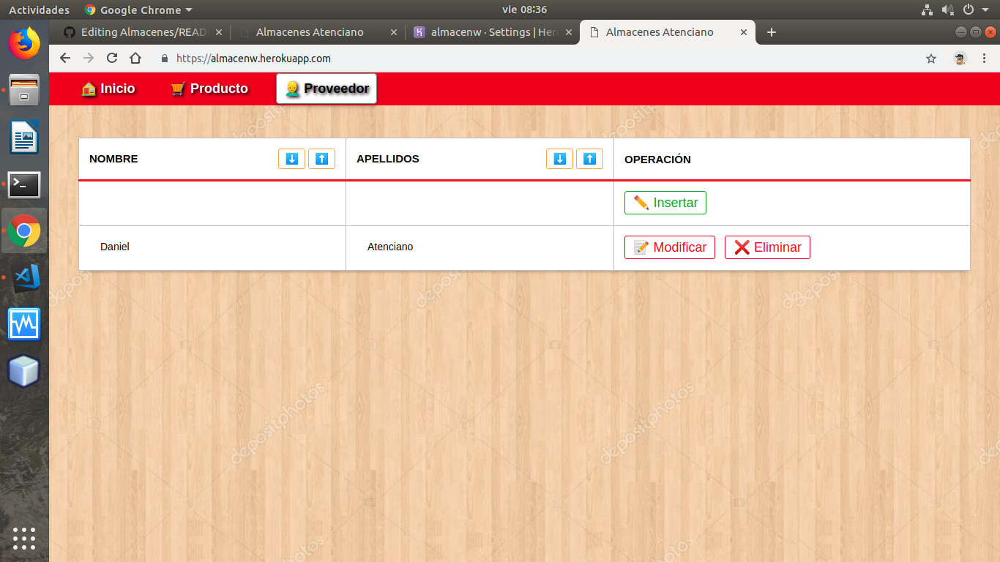

# Almacenes
PWA + FullStack(MongoDB, Express, NodeJS)

Mi aplicación trata sobre una página web destinadas al almacenamiento de objetos. Tiene dos páginas una de producto y proovedor.

Este es un proyecto realizado con fines educativos. Actualmente está desplegado en [Heroku](https://almacenw.herokuapp.com/).


La interfaz está desarrollada en forma de SPA (Single Page Application).








Los archivos utilizados son los siguientes:


```
├── package.json
├── package-lock.json
├── server.js
├── models.js
├── routes.js
├── config.js
├── public
│   ├── manifest.json
│   ├── service-worker.js
│   ├── images/icons/*
│   ├── favicon.png
│   ├── index.html
│   ├── style.css
│   └── app.js
└── README.md
```

Para el FrontEnd los archivos necesarios son:

- public/favicon.png
- public/index.html
- public/style.css
- public/app.js

Para Aplicación Web Progresiva

- public/manifest.json
- public/service-worker.js
- public/images/icons/*